> больше полезных материалов по разработке в тг https://t.me/typo_programmist

**Содержание:**

<!-- TOC -->
  * [Java Core](#java-core)
    * [Контракт equals и hashcode](#контракт-equals-и-hashcode)
    * [Что такое конструктор по умолчанию?](#что-такое-конструктор-по-умолчанию)
    * [Области видимости java](#области-видимости-java)
    * [Что такое неизменяемые (immutable) классы? Почему String неизменяемый?](#что-такое-неизменяемые-immutable-классы-почему-string-неизменяемый)
    * [Расскажи про исключения в java](#расскажи-про-исключения-в-java)
    * [Расскажи про Java Collection Framework](#расскажи-про-java-collection-framework)
    * [ArrayList vs LinkedList](#arraylist-vs-linkedlist)
    * [HashMap vs TreeMap](#hashmap-vs-treemap)
    * [В чем разница между String, StringBuilder и StringBuffer](#в-чем-разница-между-string-stringbuilder-и-stringbuffer)
    * [Какие есть виды ссылок в Java?](#какие-есть-виды-ссылок-в-java)
    * [Garbage Collector](#garbage-collector)
    * [Java heap dump debug](#java-heap-dump-debug)
    * [Ленивые операции в Stream API](#ленивые-операции-в-stream-api)
    * [Как устроена память в Java?](#как-устроена-память-в-java)
    * [Как работать с БД в Java?](#как-работать-с-бд-в-java)
    * [Как остановить поток Java](#как-остановить-поток-java)
    * [Дженерики - что это такое и зачем нужны](#дженерики---что-это-такое-и-зачем-нужны)
    * [Расскажи про принцип PECS](#расскажи-про-принцип-pecs)
    * [Что такое JIT](#что-такое-jit)
  * [Kotlin](#kotlin)
    * [Как в koltin сделать static](#как-в-koltin-сделать-static)
  * [ООП](#ооп)
    * [Чем интерфейс отличается от абстрактного класса?](#чем-интерфейс-отличается-от-абстрактного-класса)
    * [Как расшифровывается аббревиатура SOLID?](#как-расшифровывается-аббревиатура-solid)
    * [Расскажи про принципы ООП](#расскажи-про-принципы-ооп)
  * [Общие](#общие)
    * [Что такое инверсия управления (IoC)?](#что-такое-инверсия-управления-ioc)
    * [Что такое внедрение зависимостей?](#что-такое-внедрение-зависимостей)
    * [Идемпотентые методы REST](#идемпотентые-методы-rest)
    * [Метод работает очень долго, всегда ли проблема именно в коде?](#метод-работает-очень-долго-всегда-ли-проблема-именно-в-коде)
    * [Когда стоит использовать OLTP, а когда OLAP систему?](#когда-стоит-использовать-oltp-а-когда-olap-систему)
    * [Расскажи про паттер Transactional Outbox](#расскажи-про-паттер-transactional-outbox)
    * [Паттерн SAGA](#паттерн-saga)
  * [Java Multythreading](#java-multythreading)
    * [Atomic vs synchronized vs volatile](#atomic-vs-synchronized-vs-volatile)
  * [Реляционные БД](#реляционные-бд)
    * [Какие есть поля у базы данных? Чем отличаются поля?](#какие-есть-поля-у-базы-данных-чем-отличаются-поля)
    * [Что такое constraint в БД?](#что-такое-constraint-в-бд)
    * [В чем разница между DELETE и TRUNCATE](#в-чем-разница-между-delete-и-truncate)
    * [Что такое индексы в БД? Как работают индексы, как их правильно использовать?](#что-такое-индексы-в-бд-как-работают-индексы-как-их-правильно-использовать)
    * [Чем отличатеся B-Tree индекс и Hash-index](#чем-отличатеся-b-tree-индекс-и-hash-index)
    * [Что такое каскадирование в БД?](#что-такое-каскадирование-в-бд)
    * [Каким инструментом можно посмотреть подробное описание выполнения запроса в БД?](#каким-инструментом-можно-посмотреть-подробное-описание-выполнения-запроса-в-бд)
    * [Что работает быстрее Statement или PreparedStatement?](#что-работает-быстрее-statement-или-preparedstatement)
    * [Что такое concurrency в БД?](#что-такое-concurrency-в-бд)
    * [Что такое транзакции в БД?](#что-такое-транзакции-в-бд)
    * [Что такое блокировки в БД?](#что-такое-блокировки-в-бд)
    * [ACID vs BASE транзакции](#acid-vs-base-транзакции)
    * [Уровни изоляций транзакций](#уровни-изоляций-транзакций)
    * [Расскажи про проблему N+1](#расскажи-про-проблему-n1)
    * [Optimistic и Pessimistic locking exception](#optimistic-и-pessimistic-locking-exception)
  * [Spring](#spring)
    * [Какие есть способы конфигурирования Spring приложений?](#какие-есть-способы-конфигурирования-spring-приложений)
    * [Что такое Spring Bean?](#что-такое-spring-bean)
    * [Виды скоупов в Spring](#виды-скоупов-в-spring)
    * [В чём разница @Autowired и @RequiredArgsConstructor?](#в-чём-разница-autowired-и-requiredargsconstructor)
    * [Жизненный цикл бина в Spring?](#жизненный-цикл-бина-в-spring)
    * [Расскажи про аннотации @Contoller @Service @Repository в Spring](#расскажи-про-аннотации-contoller-service-repository-в-spring)
    * [Чем отличается @Mock от @Mockbean](#чем-отличается-mock-от-mockbean)
  * [Kafka](#kafka)
    * [Что такое Partition в Kafka](#что-такое-partition-в-kafka)
    * [Что такое Consumer Group в Kafka](#что-такое-consumer-group-в-kafka)
<!-- TOC -->

[//]: # (TODO: ## Опыт)

[//]: # (TODO: здесь можно написать про STAR и базовые вопросы)

## Java Core

[//]: # (TODO: ### Устройство объекта Object)

### Контракт equals и hashcode

1. Повторный вызов hashCode для одного и того же объекта должен возвращать одинаковые хеш-значения, если поля объекта, участвующие в вычислении значения, не менялись.
2. Если equals() для двух объектов возвращает true, hashCode() также должен возвращать для них одно и то же число.
3. При этом неравные между собой объекты могут иметь одинаковый hashCode.

Это ускоряет проверку, сперва производится сравнение по хешу, чтобы понять, совпадают ли объекты, а только после подключается equals, чтобы определить, совпадают ли значения полей объекта.

### Что такое конструктор по умолчанию?

В Java есть три различных типа конструкторов:
- Default Constructor (Конструктор по умолчанию)
- No-Argument Constructor (Конструктор без аргументов)
- Parameterized Constructor (Параметризованный конструктор)

Конструктор по умолчанию (Default Constructor) — это конструктор, созданный JVM во время выполнения, если конструктор не определен в классе.
Он инициализирует поля класса значениями по умолчанию.

```java
class DefaultConstructor{
    int id;
    String name;
}
```

Внутри JVM появится конструктор по умолчанию для этого класса, если мы создадим объект

```java
DefaultConstructor df= new DefaultConstructor();
```

Теперь, если мы напечатаем значение, то получим:

```java
df.id = 0
df.name = null.
```

### Области видимости java

В Java используются следующие модификаторы доступа:

- **public**: публичный, общедоступный класс или компонент класса. Поля и методы, объявленные с модификатором public, видны другим классам из текущего пакета и из внешних пакетов, вообще в любом месте программы. 

    Стоит отметить, что в исходном файле может быть только один класс с модификатором public, но количество классов с другими модификаторами (или без них) может быть любым. И если в файле есть класс с модификатором public, то имя файла должно совпадать с именем этого класса.
- **private**: закрытый класс или компонент класса, противоположность модификатору public. Закрытый класс или компонент класса доступен только из кода в том же классе.
- **protected**: такой класс или компонент класса доступен из любого места в текущем классе или пакете или в производных классах, даже если они находятся в других пакетах
- **Модификатор по умолчанию**: Отсутствие модификатора у поля или метода класса предполагает применение к нему модификатора по умолчанию. Такие поля или методы видны всем классам в текущем пакете.

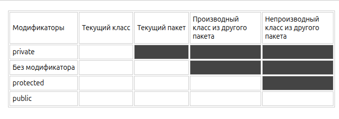


### Что такое неизменяемые (immutable) классы? Почему String неизменяемый?

Объект, состояние которого нельзя изменить после создания. Все поля final, класс объявлен как final (чтобы нельзя было создать мутабельный сабкласс), нет сеттеров.
Причины неизменяемости String:
- **Безопасность**: String широко используется для параметров (URL, путь к файлу, имена классов). Если бы String был изменяемым, это могло бы привести к уязвимостям.
- **Потокобезопасность**: Immutable объекты безопасны в многопоточной среде, так как их состояние не может измениться, что исключает ошибки синхронизации.
- **Кэширование**: Поскольку строка не меняется, её хэш-код рассчитывается один раз и кэшируется, что делает String идеальным ключом в HashMap или HashSet.

### Расскажи про исключения в java


Всё исключения - это объект, они реализуют единый интерфейс Throwable (что-то что может быть выкинуто)

- **Error** - это ошибки на уровне JVM (Например, OutOfMemory, StackOverflow) их мы не обрабатываем в программе.
- **Exception** - ошибки на уровне программы. Их мы уже обрабатываем на уровне программы. Exception бывают checked и unchecked.


- **Checked exception** - разработчики Java добавили их, заставлять программиста избегать частых ошибок и обрабатывать их (Нет файла)
- **Unchecked exception** - они возникают в ходе исполнения программы (Runtime exception) (Деление на 0; обращение по индексу, которого нет в массиве).

* блок try - выполняет блок кода, который может вызвать исключение
* блок catch - обрабатывает исключение
* блок finally - дополнительный, выполняется ВСЕГДА после try-catch:

Даже тут runTimeExceptionFinally() вернёт 3:
```java
public static int runTimeExceptionFinally() {
    try {
        return 1;
    } catch (ArithmeticException e) {
        return 2;
    } finally {
        return 3;
    }
}
```

Если зашёл об этом разговор, нападай! Дай задачу:
```java
public static int runTimeExceptionFinally() {
    try {
        System.exit(0);
        return 1;
    } catch (ArithmeticException e) {
        return 2;
    } finally {
        return 3;
    }
}
```

Спроси, что выведится - ничего, finally в таком случае не отработает

### Расскажи про Java Collection Framework


Этот фреймворк реализует основные типы коллекций, которые нам могут понадобится в работе (List, Set, Map, Queue, Deque)

У этих коллекций 2 корня Collection - набор элементов, Map - набор пар ключ-значение

Корневым интерфейсом в JCF является Iterable, который позволяет перебирать элементы коллекции.

От Iterable наследуется интерфейс Collection, который служит основой для большинства других коллекций. Он предоставляет базовые методы, такие как add(), remove(), contains(), size() и другие.

Для повышения производительности в многопоточной среде, Java предоставляет более современные потокобезопасные коллекции, доступные в пакете java.util.concurrent:

* **CopyOnWriteArrayList** — потокобезопасная альтернатива ArrayList, где операции изменения создают копию списка, что исключает проблемы, связанные с итерацией.
* **ConcurrentHashMap** — потокобезопасная версия HashMap, оптимизированная для работы в многопоточных средах без блокировок всех операций.
* **ConcurrentLinkedQueue** — неблокирующая очередь, основанная на связанных узлах.

### ArrayList vs LinkedList

ArrayList:
* get(int index): O(1) — доступ по индексу.
* add(E element): Амортизированная O(1), но может быть O(n) при расширении.
* add(int index, E element): O(n) — нужно сдвигать элементы.
* iterator(): Итерация по массиву происходит очень быстро за счет локальности данных (кэш-память CPU).

LinkedList:
* get(int index): O(n) — нужно пройти от начала/конца до нужного элемента.
* add(E element): O(1) — просто повесить ссылку в конце.
* add(int index, E element): O(n) — сначала найти позицию (O(n)), потом повесить ссылки.
* iterator(): Итерация тоже O(n), но каждый следующий элемент — это переход по ссылке, что медленнее для кэша процессора, чем последовательное чтение массива.

Итерация по всему списку в LinkedList будет медленнее, чем в ArrayList, из-за промахов в кэше, даже если асимптотически это O(n). ArrayList — почти всегда выбор по умолчанию.

### HashMap vs TreeMap

* **HashMap**: Хранит ключи на основе хэш-кода. Позволяет null ключ и значения. Не гарантирует порядка. Сложность O(1) для get/put (в идеале).
* **TreeMap**: Реализует NavigableMap. Хранит ключи отсортированными согласно natural order или переданному Comparator. Основан на Красно-черном дереве. Сложность O(log n). Не допускает null ключей (сравнение выбросит NPE).

### В чем разница между String, StringBuilder и StringBuffer

* **String** — неизменяемый (immutable) класс, любая операция создает новый объект. Подходит для константных строк. Создавая через кавычки объект попадает в StringPool, через new() - в кучу.
* **StringBuilder** — изменяемый (mutable), работает быстрее StringBuffer, но не потокобезопасен. Используется для динамического построения строк в однопоточных приложениях.
* **StringBuffer** — аналогичен StringBuilder, но синхронизирован (потокобезопасен), что делает его медленнее.

Важно, что когда мы выполняем операцию конкатенации строк, например:
String result = "Hello" + ", " + "World" + "!";


JVM фактически выполняет следующие действия:
Создает временный объект StringBuilder
Добавляет каждую строку в этот StringBuilder
Вызывает метод toString() для создания финального объекта String
Это можно увидеть в байткоде, сгенерированном для такой операции. Однако, ситуация меняется внутри циклов. Рассмотрим следующий код:
```java
String result = "";
for (int i = 0; i < 1000; i++) {
    result += "some text";
}
```

В этом случае компилятор не оптимизирует код автоматически, и для каждой итерации создается новый StringBuilder, что приводит к созданию 1000 промежуточных объектов StringBuilder и String, большинство из которых немедленно становятся мусором. То есть StringBuilder выделяет, как массив нужную для него память с запасом, в то время как String каждый раз занимает новые ячейки памяти. На больших объёмах в цикле StringBuilder работает за O(n), а String за O(n^2).

### Какие есть виды ссылок в Java?

В Java есть 4 вида ссылок. По сути, различие между всеми типами ссылок только одно — поведение GC с объектами, на которые они ссылаются.

- Стандартный **StrongReference** — это самые обычные ссылки которые мы создаем каждый день. StringBuilder builder = new StringBuilder();
builder это и есть strong-ссылка на объект StringBuilder. Любой объект что имеет strong ссылку запрещен для удаления сборщиком мусора.

И есть 3 «особых» типа ссылок — SoftReference, WeakReference, PhantomReference.

- **SoftReference** — если GC видит что объект доступен только через цепочку soft-ссылок, то он удалит его из памяти. Потом. Наверно. Зависит от JVM. Одно знаем точно: GC гарантировано удалит с кучи все объекты, доступные только по soft-ссылке, перед тем как бросит OutOfMemoryError. То что нужно для кэширования.
- **WeakReference** — если GC видит что объект доступен только через цепочку weak-ссылок, то он “сразу” удалит его из памяти. Когда кэшировать объект не имеет смысла. Нам нужно только использовать его и желательно “сразу” удалить из памяти, когда объект более не используется программой.
- **PhantomReference** — если GC видит что объект доступен только через цепочку phantom-ссылок, то он его удалит из памяти. После нескольких запусков GC. Этот тип ссылок в позволяет нам узнать, когда объект более недоступен и на него нет других ссылок. Это позволяет нам сделать очистку ресурсов, используемых объектом, на уровне приложения.
https://habr.com/ru/articles/169883/

### Garbage Collector

Garbage Collector далее GC: При запуске сборщика виртуальная машина рекурсивно находит, для всех потоков, все доступные объекты в памяти и помечает их неким образом. А на следующем шаге GC удаляет из памяти все непомеченные объекты. Таким образом, после чистки, в памяти будут находиться только те объекты, которые могут быть полезны программе.

| Сборщик Мусора | Преимущества | Недостатки | Идеален для |
|----------------|--------------|------------|-------------|
| Serial GC | Простота, эффективность для малых приложений | Низкая производительность на многопроцессорных системах | Малые приложения, ограниченные ресурсы |
| Parallel GC | Высокая пропускная способность | Длинные паузы GC | Серверные приложения, многопроцессорные системы |
| CMS | Низкие паузы GC | Возможная фрагментация памяти, сложность | Интерактивные приложения |
| G1 GC | Баланс между производительностью и задержкой, масштабируемость | Может требовать тонкой настройки | Большие серверные приложения |
| ZGC/Shenandoah | Минимальные паузы | Новизна, потенциальные ограничения в использовании | Приложения с требованиями к ультранизкой задержке |

### Java heap dump debug

Чтобы сделать heap dump на запущенном приложении:

С помощью команды `jps` узнаём id процесса

Вызываем heap dump текущего состояния

```bash
jcmd 87777 GC.heap_dump ~/Documents/heapDumpс.hprof
```

Далее этот heap dump файл можно открыть в profiler в IDEA

Чтобы сделать heap dump при остановке приложения:

В VM options нужно добавить флаг `-XX:+HeapDumpOnOutOfMemoryError`

Так, при остановке приложения с ошибкой OutOfMemoryError рядом появится файл heap dump. Важно, этот файл в размере от 1 гигабайта и более, на сервере должно быть свободно место.

Подробнее в видео:
https://youtu.be/IUUoMVaXzas?si=9ByNyX5Q3NEhnAsi

### Ленивые операции в Stream API

Операции в стримах делятся на промежуточные (intermediate) и терминальные (terminal). Промежуточные операции (filter, map, sorted) являются "ленивыми". Они не выполняются сразу при вызове, а только запоминаются. Вычисление начинается только тогда, когда вызывается терминальная операция (collect, forEach, count). Это позволяет оптимизировать обработку, не перебирать данные лишний раз и работать с бесконечными потоками.


Важно:
* Промежуточных операторов вызванных на одном стриме может быть несколько, в то время терминальный оператор только один
* Обработка не начнётся до тех пор, пока не будет вызван терминальный оператор.
* Как только была вызвана терминальная операция, поток считается исчерпанным и больше не может быть использован.

**Stateless и Stateful операции**

- Операции без состояния, такие как map() и filter(), обрабатывают каждый элемент потока независимо от других.
- Операции с состоянием, такие как sorted(), distinct() или limit(), требуют информации о других элементах потока. Эти операции не могут начать возвращать результаты, пока не обработают часть или весь поток.

При добавлении операций с состоянием поток делится на секции, и каждая секция должна завершить свою обработку перед началом следующей.

```java
public static void main(String[] args) {
    final List<String> list = List.of("one", "two", "three");

    list.stream()
            .filter(s -> {
                System.out.println("filter: " + s);
                return s.length() <= 3;
            })
            .map(s1 -> {
                System.out.println("map: " + s1);
                return s1.toUpperCase();
            })
            .sorted()
            .forEach(x -> {
                System.out.println("forEach: " + x);
            });
}
```

```text
filter: one
map: one
filter: two
map: two
filter: three
forEach: ONE
forEach: TWO
```

**Ленивая обработка в stream api**
```java
public static void main(String[] args) {
    final List<String> list = List.of("one", "two", "three");

    list.stream()
            .filter(s -> {
                System.out.println("filter: " + s);
                return s.length() <= 3;
            })
            .map(s1 -> {
                System.out.println("map: " + s1);
                return s1.toUpperCase();
            })
            .forEach(x -> {
                System.out.println("forEach: " + x);
            });
}
```

На первый взгляд может показаться, что весь список сначала отфильтруется, затем преобразуется, а после этого будет выведен на консоль. Однако, благодаря ленивой обработке, это происходит не так. Вместо того, чтобы обрабатывать все элементы на каждом этапе, Stream API последовательно пропускает каждый элемент через весь пайплайн операций.
```text
filter: one
map: one
forEach: ONE
filter: two
map: two
forEach: TWO
filter: three
```

Этот поэтапный подход делает параллелизм более простым и безопасным. Поскольку каждый элемент обрабатывается независимо, легко перейти от последовательного к параллельному потоку.

**Параллельное выполнение**

По умолчанию потоки выполняются последовательно, но с явным вызовом одного из методов parallelStream() или parallel() поток переключается в параллельный режим.

Если в JVM стоит другая настройка и потоки по умолчанию параллельные, то сделать их однопоточными можно через sequential()

Главное понимать, что тот флаг паралельности, которые будет проставлен перед терминальной операции означает каким будет поток, место вызова флага не важно:

```java
new Random().ints(1, 20+1).distinct().limit(5).sum(); // однопоточная операция в стандартном JVM
new Random().ints(1, 20+1).parallel().distinct().limit(5).sum(); // паралельный вызов
new Random().ints(1, 20+1).distinct().parallel().limit(5).sum(); // паралельный вызов
new Random().ints(1, 20+1).distinct().limit(5).parallel().sum(); // паралельный вызов - порядок не важен
new Random().ints(1, 20+1).parallel().distinct().limit(5).sequntial().sum(); // однопоточный вызов, так как перед терминальна
```

### Как устроена память в Java?

Модель памяти в Java, используемая внутри JVM, делит память на стеки потоков (**thread stacks**) и кучу (**heap**).

Все потоки, работающие в JVM, имеют свой стек:


Стек потока содержит:
* Стек вызова (какие методы вызвал поток)
* Все локальные переменные (boolean, byte, short, char, int, long, float, double)
* Ссылка (локальная переменная) хранится в стеке потоков, но сам объект хранится в куче

Когда метод завершает выполнение, блок памяти (frame), отведенный для его нужд, очищается, и пространство становится доступным для следующего метода. (LIFO)

Куча (Heap) содержит:
* Новые объекты всегда создаются в куче, а ссылки на них хранятся в стеке.
* Поля объекта хранятся в куче вместе с самим объектом, даже если это примитивные типы.
* Все массивы, независимо от того, содержат ли они примитивные типы или объекты
* Хранит String pool

Куча делится на поколения для оптимизации работы GC:
* **Young Generation**: Место появления новых объектов.
* **Old Generation**: Место для «долгоживущих» объектов, переживших несколько циклов сборки мусора.
Хабр

Также есть области:
* **Metaspace**: Хранит метаданные классов, код методов и статические переменные. Пример, информация о том, что у класса User есть метод login(), будут лежать в Metaspace.
* **PC Registers**: Хранят адрес текущей инструкции, выполняемой потоком. Пример, если ваш поток (Thread) сейчас выполняет сложение a + b, PC Register хранит адрес этой конкретной инструкции. Как только сложение завершится, регистр обновится и укажет на следующую строку (например, System.out.println). Так, если операционная система прервет работу потока, чтобы дать поработать другому, благодаря PC Register поток «вспомнит», на чем он остановился.
* **Native Method Stack**: Память для методов, написанных на других языках (например, C/C++). Java часто обращается к функциям, написанным на C или C++ (например, для работы с файлами, сокетами или видеокартой). Когда вы вызываете native методы System.currentTimeMillis(), Java обращается к операционной системе

[//]: # (TODO: ### Что такое thread-local переменные?)

### Как работать с БД в Java?

Есть 3 семейства как можно работать с БД:
* **JDBC** (В Java мире это один способ, всё остальное - надстройка) и jdbcTemplate

* Query Builder - **jooq** (жук)
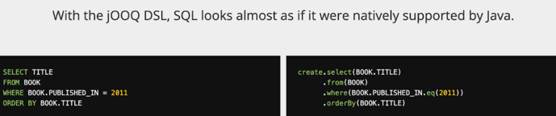
* **ORM** (Hibernate, Object Relational Maping)


### Как остановить поток Java

Правильный способ остановить поток в Java — использовать механизм прерываний interrupt()

### Дженерики - что это такое и зачем нужны

Это обобщение, когда пишим один код сразу под работу с разными типами. Выглядит примерно так:
```java
class Person<T> {
 
    private T id;  
    private String name;
 
    T getId(){ return id; }
    String getName(){ return name; }
 
    Person(T id, String name)
    {
        this.id = id; 
        this.name = name;
    }
}
```

### Расскажи про принцип PECS

Producer Extends Consumer Super - означает что коллекция-поставщик использует extends, а коллекция-потребитель использует super

Пример:

```java
static class Fruit {
}

static class Citrus extends Fruit {
    int weight;
}

static class Orange extends Citrus {
    int color;
}

static class BigRoundOrange extends Orange {
    int size = 100;
}

// коллекция-поставщик данных
static int totalWeight(List<? extends Citrus> citrusList) {
    int total = 0;
    for (Citrus c : citrusList)
        total += c.weight;
    return total;
}

// коллекция-потребитель изменений
static void addOranges(List<? super Orange> orangeArrayList) {
    for (int i = 0; i < 10; i++)
        orangeArrayList.add(new Orange());

    orangeArrayList.add(new BigRoundOrange()); // можно
    orangeArrayList.add(new Orange()); // можно
    orangeArrayList.add(new Citrus()); // нельзя
    orangeArrayList.add(new Fruit()); // нельзя
}
```

Пример использования - метод copy из Collections Framework:
```java
public static <T> void copy(List<? super T> dest, List<? extends T> src) {
```

### Что такое JIT

Это часть виртуальной машины Java (JVM), которая повышает производительность приложений, преобразуя байт-код в машинный код непосредственно во время исполнения. Вместо интерпретации каждой инструкции, JIT компилирует часто используемые («горячие») фрагменты кода в родной машинный код, который процессор выполняет напрямую.

JVM сначала интерпретирует байт-код. JIT отслеживает часто вызываемые методы («горячий код») и компилирует их, чтобы ускорить повторные выполнения.

Примеры использования:
- Компиляция методов: Повторяющиеся вызовы методов компилируются в машинный код.
- Оптимизация циклов: Длинные циклы компилируются для быстрого выполнения.
- Встраивание (Inlining): JIT может встраивать код небольших методов непосредственно в вызывающий метод, устраняя накладные расходы на вызов.

[//]: # (TODO: ### JVM, JRE, JDK - в чём разница)
[//]: # (https://wiki.merionet.ru/articles/jdk-jre-jvm-v-cem-raznica)

## Kotlin

### Как в koltin сделать static

Привычного static в Kotlin нет. 

Если взять java код и автоматически преобразовать его в kotlin, то static сотрётся. По-крайней мере так было во времена версии 1.3.

Но static в байт-коде создаётся, если
- создать функцию уровня пакета:
```kotlin
package com.example.mytestapplication

fun testFun(){
    // some code
}
```

- использовать companion object + @JvmStatic внутри класса:
```kotlin
class SimpleClassKotlin1 {

    companion object{

        // @JvmField делает поле прямым статическим полем
        @JvmStatic // будут сгенерированы статический геттер и сеттер к этому свойству
        var companionField = "Hello!"

        @JvmStatic // чтобы функция объекта-компаньона также преобразовалась в статический метод
        fun companionFun (vaue: String){
            // some code
        }
    }
}
```

## ООП

### Чем интерфейс отличается от абстрактного класса?

Абстрактный класс — это «заготовка» класса: реализовано большинство методов (включая внутренние), кроме нескольких. Эти несколько нереализованных методов вполне могут быть внутренними методами класса, они лишь уточняют детали реализации. Абстрактный класс — средство для повторного использования кода, средство, чтобы указать, какой метод обязан быть перекрыт для завершения написания класса.

Интерфейс — это своего рода контракт: интерфейсы используются в определениях чтобы в первую очередь указать смысл объекта, какие у него входные и выходные параметры.

### Как расшифровывается аббревиатура SOLID?

* S - Single Responsibility, принцип единственности ответственности, класс должен отвечать за один конкретный функционал в программе. А значит причин для его изменения тоже будет только одна. Подключение подписки клиенту не должно выполняться вместе с поиском crmId клиента.
* O - Open Closed, принцип открытости / закрытости. Класс открыт для расширения и закрыт для изменения. Иначе так можно много поломать, новые версии должны быть совместимы со старыми файлами, идеальны пример:

* L - Liskov Substitution, принцип подстановки подкласса. Наследники класса должны сохранять расширять функционал родителя, а не изменять его. В самолете может быть просто дверь, а может быть дверь с физюляжем
* I - Interface Segregation, принцип разделения интерфейсов. Один интерфейс не должен реализовывать несколько сложных действий, так становится много ненужного кода. В машине можно выключить звук/переключить трек с руля или с магнитолы, при этом с магнитолы нельзя включить дальний свет и управлять автомобилем, это отдельные интефейсы
* D - Dependency Inversion, принцип инверсии зависимостей. Вместо зависимости от конкретных реализаций (классов) модули должны зависеть от абстрактных классов или интерфейсов. Чтобы при изменении конкретной реализации не было серьёзных проблем.


### Расскажи про принципы ООП

Есть 4 принципа - инкапсуляция, наследование, полиморфизм. Но некоторые ещё выделяют абстракцию абстракцию. 

Немного про каждый:
- **инкапсуляция**: не даём работать с данными (переменными объекта) на прямую, работать можно только через вызов соответствующих методов:
```java
public class Smartphone
{
    private int _batteryLife;

    // Метод заряжает батарею, но не имеет доступа к уровню заряда
    public void Charge(int amount)
    {
        // Устанавливаем свои правила для работы с переменной
        if (amount <= 0)
        {
            throw new ArgumentException("В метод для зарядки телефона передано значение меньше либо равное нулю")
        }
      
        _batteryLife += amount;
    }

    // Метод получает текущее значение, но не может его изменить
    public int GetBatteryLife()
    {
        return _batteryLife;
    }
}
```

- **Наследование**: Создание нового класса (наследника) на основе существующего (родителя). Новый класс перенимает свойства и поведение родителя, что позволяет переиспользовать код.

```java
public class BasicSmartphone
{
    public void Call()
    {
        Console.WriteLine("Совершаем звонок...");
    }
}

public class ProSmartphone : BasicSmartphone
{
    public void VideoCall()
    {
        Console.WriteLine("Совершаем видеозвонок...");
    }
}
```

- **Полиморфизм**: Один и тот же метод может работать по-разному в зависимости от объекта, где он вызван, и данных, которые ему передали
Некоторые выделяют ещё один принцип:
- **Абстракция**: предоставление основных функций без погружения в детали.


## Общие

### Что такое инверсия управления (IoC)?

Это архитектурный подход, когда сущность не сама создаёт свои зависимости, а когда зависимости прокидываются извне.

До IoC:


После IoC:


### Что такое внедрение зависимостей?

Внедрение зависимостей — это не технология, фреймворк, библиотека или что-то подобное. Это просто идея. Идея работать с зависимостями вне зависимого класса (желательно в специально выделенной части).

Например, через XML-конфигурацию бинов в Spring:


### Идемпотентые методы REST
Идемпотентными методами в REST (при повторном вызове которых состояние системы не меняется) являются:
* **GET**: Читает данные, не меняя состояние.
* **PUT**: Полностью обновляет или создает ресурс; повторы не создают лишних сущностей.
* **DELETE**: Удаляет ресурс; повторное удаление не меняет состояние системы (ресурс уже удален).
* **HEAD**: Получает только заголовки, безопасен.
* **OPTIONS**: Возвращает поддерживаемые методы.

Неидемпотентные методы:
* **POST**: Создает новый ресурс при каждом вызове.
* **PATCH**: Частично обновляет ресурс, может приводить к разным результатам. (Например, PATCH может делать +1 к значению, не идемпотентен)


### Метод работает очень долго, всегда ли проблема именно в коде?
1) Спроси менеджера, а должен ли он работать быстрее? Может за 15 секунд он выдаёт csv 15 мб, это вроде норм.
2) Идём в профилирование, смотрим внешние вызовы. Не всегда проблема в коде, возможно проблема в отсутствии асинхронных операций - обращение к БД, поход к внешнему API. Метод работает 700мс, 500мс проводим в базе, для начала стоит оптимизировать запросе в БД.

### Когда стоит использовать OLTP, а когда OLAP систему?

PostgreSQL (OLTP - online transaction processing)
Используем когда важна целостность каждой записи - брони клиента, его баланс.
- Хранение: Построчное (row-oriented). Это позволяет молниеносно находить, обновлять или удалять конкретную строку по индексу.
- Гарантии: Полная поддержка ACID. Уверены, что перевод денег или оформление заказа либо пройдут полностью, либо не пройдут вовсе.
- Слабое место: Когда нужно посчитать «средний чек по 100 млн заказов за год», Postgres приходится сканировать всю таблицу с диска, что крайне медленно.

ClickHouse (OLAP - online analytic processing), аналитические отчеты по гигантским массивам данных.
- Хранение: Колоночное (column-oriented). Для расчета суммы по столбцу price ClickHouse читает с диска только этот столбец, игнорируя остальные 50 полей.
- Скорость: Сжимает данные в 10–100 раз и умеет эффективно распараллеливать запрос на все ядра процессора.
- Слабое место: Крайне плохо справляется с точечными обновлениями (UPDATE одной строки) и частыми мелкими вставками. Данные в него лучше «заливать» большими пачками (батчами).


### Расскажи про паттер Transactional Outbox

Паттер актуален когда нам критически важно чтобы данные не дублировались - например, когда работаем с данными о заказах клиента.

Самая простая архитектура с синхронным взаимодействием выглядит так:
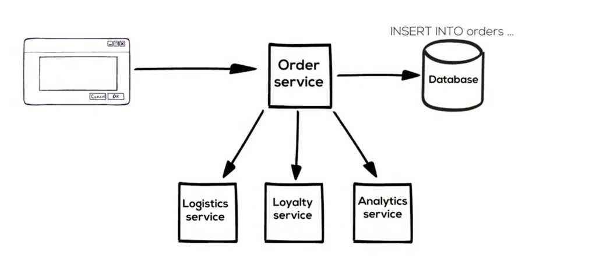

Минусы:
- при добавлении нового потребителя нужно изменять сервис orders
- нужно определять поведение при отказе для каждого сервиса

Чтобы решить первый недостаток, стоит использовать брокер сообщений. Так мы переходим к ассинхронному взаимодействию:

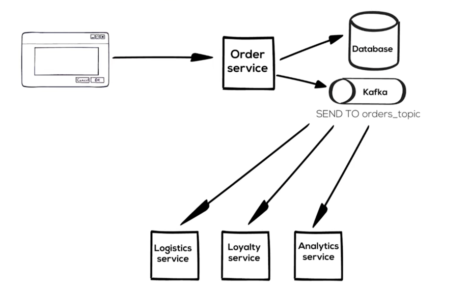

Но при добавлении брокера и с ним могут возникнуть проблемы:

```kotlin
fun processOrder(Order order) {
    sendToDatabase(order)
    // error - что если сервер упадёт в этот момент
    sendToKafka(order)
}
```

```kotlin
fun processOrder(Order order) {
    sendToKafka(order) // что если не вернул ответ, считаем его неуспешным, а остальные сервисы уже стали его обрабатывать
    // error - что если сервер упадёт в этот момент
    sendToDatabase(order)
}
```

Проблему падения сервиса в моменте легко решить, нужно оба действия делать в рамках транзакции:
```kotlin
@Transactional
fun processOrder(Order order) {
    sendToKafka(order) // что если не вернул ответ, считаем его неуспешным, а остальные сервисы уже стали его обрабатывать
    sendToDatabase(order)
}
```

Для решения последней проблемы нужно использовать паттерн transactional outbox

Первый этап: создаём таблицу orders_outbox
```sql
CREATE TABLE orders_outbox (
    id UUID primary key, // id записи
    payload JSONB, // какую инфу шлём
    sent BOOLEAN default FALSE, // статус что сообщение отпралвено
)
```

Создаём корутину, которая:
- открывает транзакцию
- вычитывает из таблицы orders_outbox все строчки где sent = false
- блокирует их
- в рамках транзакции отправляет в kafka
- в случае успеха ставит sent = TRUE
- закрывает транзакцию

Второй этап: решить проблему дублирования чтения на стороне сервисов. Для этого нужно на стороне consumer настроить ключ идемпотентности:

Например, на стороне consumer смотрим в табличку уже обработанных message - нужна созданная таблица + примерно такая логика:
```kotlin
fun processMessage(Message message) {
    order = message.payload
    if (isOrderProcessed(order.id)) 
        return
    // бизнес-логика
}
```

### Паттерн SAGA

Вместо одной длительной ACID-транзакции, Saga разбивает ее на последовательность локальных транзакций, где каждый шаг вызывает следующий, а в случае ошибки выполняются компенсирующие транзакции для отката изменений.

Вместо одной большой транзакции Saga разбивает процесс на цепочку локальных транзакций. Каждый сервис выполняет свою часть работы и публикует событие или сообщение, которое запускает следующий шаг.
Если на каком-то этапе происходит ошибка, Saga запускает компенсирующие транзакции — это действия, которые «отменяют» предыдущие успешные шаги (например, если нет товара на складе, система возвращает деньги на карту).

Тот же паттерн реализует Camunda.  Camunda сама понимает, какие шаги уже успешно завершились, и запускает компенсации только для них в обратном порядке

## Java Multythreading

### Atomic vs synchronized vs volatile

Volatile — чтобы видели, Atomic — чтобы считали, Synchronized — чтобы не мешали.

**volatile** — Флаг остановки (Сигнал)
   
Идеально, когда один поток меняет состояние, а остальные должны это немедленно увидеть, но не менять значение сами:
```java
public class TaskRunner {
    private volatile boolean keepRunning = true; // Видимость для всех ядер

    public void stop() {
        keepRunning = false; // Поток управления меняет флаг
    }

    public void run() {
        while (keepRunning) {
            // Рабочий поток крутится, пока флаг true
        }
        System.out.println("Stopped!");
    }
}
```

**Atomic** — Безопасный счетчик (Инкремент)

Используем, когда несколько потоков одновременно изменяют одну переменную (увеличивают, уменьшают, складывают).

```java
import java.util.concurrent.atomic.AtomicInteger;

public class RequestCounter {
    private final AtomicInteger count = new AtomicInteger(0);

    public void increment() {
        count.incrementAndGet(); // Атомарно: +1 без блокировки потоков
    }

    public int getCount() {
        return count.get();
    }
}

```

**synchronized** — Согласованность данных (Транзакция)
   
Необходимо, когда нужно атомарно изменить сразу несколько полей или выполнить сложную проверку. Atomic тут не поможет, так как он защищает только одну переменную за раз.

```java
public class BankAccount {
    private int balance = 1000;

    // Блокируем весь метод, чтобы никто не вклинился между проверкой и списанием
    public synchronized void withdraw(int amount) {
        if (balance >= amount) { // Проверка
            balance -= amount;   // Списание
            System.out.println("Success! Remaining: " + balance);
        } else {
            System.out.println("Not enough money!");
        }
    }
}

```

[//]: # (TODO: ## Git)

## Реляционные БД

### Какие есть поля у базы данных? Чем отличаются поля?

**Числовые:** 
  - Целые числа:
  INT, UNSIGNED — только положительные значения.
  - Числа с плавающей точкой:
  FLOAT, DOUBLE.
  - Фиксированная точность:
  DECIMAL, NUMERIC — для финансовых операций.

**Текстовые:**
  - CHAR(n) — фиксированная длина.
  - VARCHAR(n) — переменная длина.
  - TEXT — большие текстовые блоки.

**Дата и время:**
  - DATE — только дата (YYYY-MM-DD).
  - TIME — только время (HH:MM:SS).
  - DATETIME, TIMESTAMP — дата и время.

**Булевые:**
  - BOOLEAN

**Бинарные:**
  - BLOB — для хранения двоичных данных (изображений, файлов).

**Другие специализированные типы:**
  - JSON — для хранения структурированных данных в формате JSON.
  - ENUM — для хранения предопределённого списка значений.
  - GEOMETRY — для геопространственных данных.

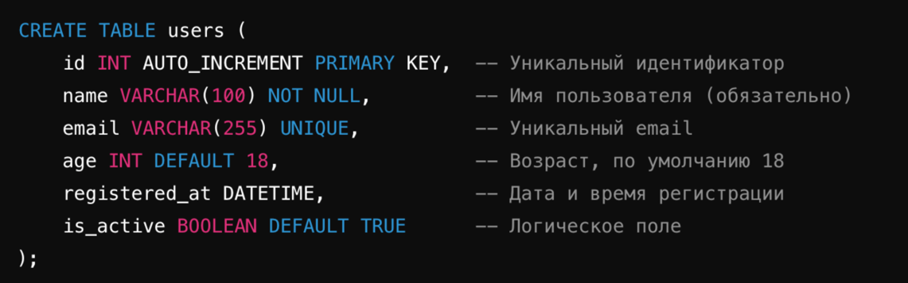

Отличия полей:
- Тип данных - одно поле может хранить числа (INT), другое — текст (VARCHAR).
- Ограничения - одно поле может быть PRIMARY KEY, другое — NOT NULL.
- Индексируемость - поля могут быть индексируемыми или нет.
- Возможность хранения NULL - одни поля допускают NULL, другие — нет.
- Предназначение - поле может быть ключом, ссылкой или просто значением.

### Что такое constraint в БД?

Это заранее прописанные ограничения на поля в таблице, пример:

При создании таблицы:
```sql
CREATE TABLE users (
id INT PRIMARY KEY,
email VARCHAR(255) UNIQUE,
age INT CHECK (age >= 18),
is_active BOOLEAN DEFAULT TRUE
);
```

Добавление Constraints к существующей таблице:
```sql
ALTER TABLE users ADD CONSTRAINT chk_age CHECK (age >= 18);
ALTER TABLE orders ADD CONSTRAINT fk_user FOREIGN KEY (user_id) REFERENCES users(id);
```
Удаление Constraints:
```sql
ALTER TABLE users DROP CONSTRAINT chk_age;
```

### В чем разница между DELETE и TRUNCATE

- **DELETE** — удаляет строки из таблицы одну за другой (долго) с возможностью фильтрации через WHERE. Она логируется, может быть откачена (ROLLBACK) и запускает триггеры.
- **TRUNCATE** — удаляет таблицу и пересоздаёт её заново (быстро) без возможности фильтрации. Не логируется (кроме некоторых СУБД), не вызывает триггеры удаления, сбрасывает автоинкремент.

### Что такое индексы в БД? Как работают индексы, как их правильно использовать?

Индексы - это специальные структуры данных, которые помогают ускорить операции в таблице.

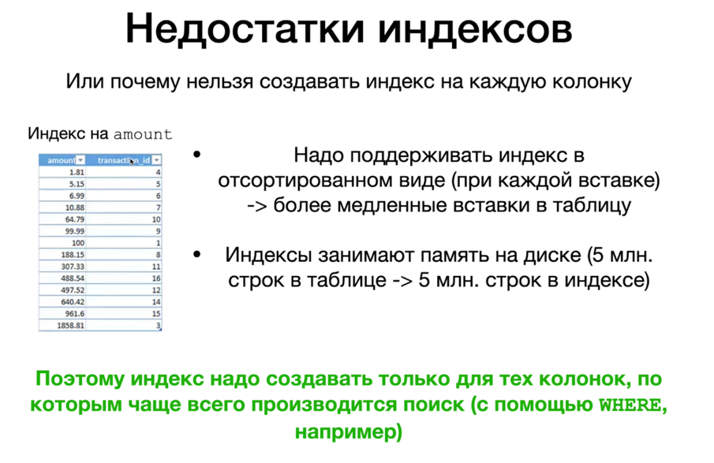

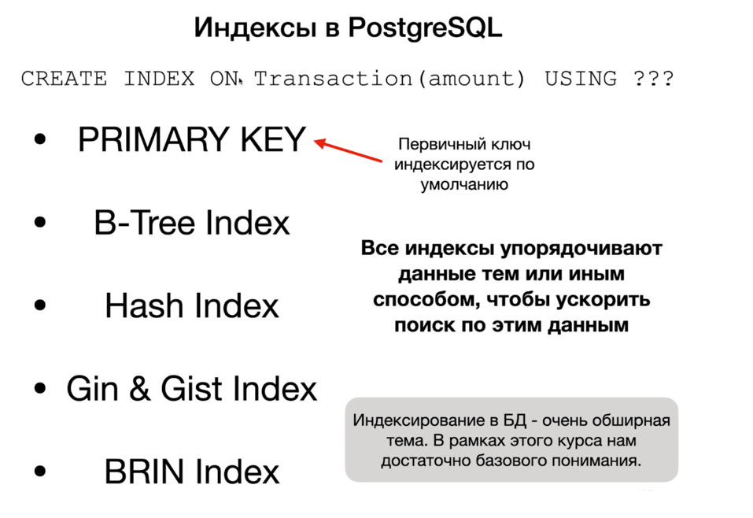

### Чем отличатеся B-Tree индекс и Hash-index

- B-Tree - Универсальный выбор для большинства запросов, хранит данные упорядоченно (балансированное дерево), поддерживая поиск диапазонов (BETWEEN, >, <) и сортировку (ORDER BY). 
- Hash-индекс использует хэш-таблицу для мгновенного(O(1) в среднем) точного поиска (=, IN), можно хранить среди ключей Null, но не поддерживает сортировку и диапазоны.

### Что такое каскадирование в БД?

Каскадирование - автоматическое выполнение действий (удаления или обновления) над дочерними записями при изменении связанной родительской записи.

Пример:
```sql
user_id int REFERENCES Person(user_id) ON DELETE <значение>;
```

- CASCADE: Автоматически удаляет/обновляет зависимые строки.
- SET NULL: Зависимые строки сохраняются, но поле внешнего ключа становится NULL.
- RESTRICT: Запрещает удаление/обновление родителя, если есть дочерние записи (обычно поведение по умолчанию).

### Каким инструментом можно посмотреть подробное описание выполнения запроса в БД?

EXPLAIN (ANALYZE) <sql запрос>

Оператор EXPLAIN возвращает план выполнения, который генерирует планировщик PostgreSQL для данного оператора.

EXPLAIN показывает, как будут сканироваться таблицы, участвующие в операторе, - индексным сканированием, последовательным сканированием и т. д., а если используется несколько таблиц, то какой алгоритм объединения будет использован.

Наиболее важной и полезной информацией, которую возвращает оператор EXPLAIN, являются начальные затраты до возврата первой строки и общая стоимость возврата всего набора результатов.
Синтаксис оператора EXPLAIN:
EXPLAIN ( option [true / false]) sql_statement;
где опция может быть одной из следующих:
ANALYZE [ boolean ]
VERBOSE [ boolean ]
COSTS [ boolean ]
BUFFERS [ boolean ]
TIMING [ boolean ]
SUMMARY [ boolean ]
FORMAT { TEXT | XML | JSON | YAML }

### Что работает быстрее Statement или PreparedStatement?

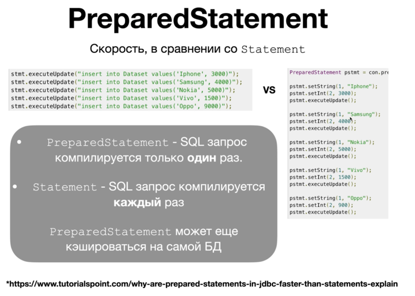

### Что такое concurrency в БД?

Конкурентность (concurrency) в контексте БД - одновременный доступа разных процессов к общим данным.

### Что такое транзакции в БД?

Транзакция – это последовательность операций, выполняемых как единое целое. Все изменения, сделанные в рамках транзакции, либо фиксируются в базе данных (коммит), либо полностью откатываются (роллбэк).

Пример:

```sql
BEGIN;
UPDATE Wallet
SET balance = balance + 250
WHERE wallet_id = '1234567890';
COMMIT;
/*Ответ от терминала*/
```

### Что такое блокировки в БД?

Блокировка — это метод ограничения доступа к данным для обеспечения корректной обработки транзакций (обеспечение их изоляции).

Сервер может применять блокировку на одном из трёх разных уровней, или гранулярностей:
- **Блокировка таблиц.** Не позволяет нескольким пользователям одновременно изменять данные в одной таблице.
- **Блокировка страниц.** Не позволяет нескольким пользователям изменять данные в одной и той же странице (страница — это сегмент памяти, обычно в диапазоне от 2 до 16 Кбайт) таблицы одновременно.
- **Блокировка строк.** Не позволяет нескольким пользователям одновременно изменять одну и ту же строку в таблице.

### ACID vs BASE транзакции

Когда речь заходит о том, выполняет ли БД требования ACID, то, как правило, речь заходит о том, гарантирует ли она изолированность транзакций.
- “A” Атомарные транзакции - либо транзакция удаётся полностью, или не происходит вообще, но она не может быть произведена лишь на какую-то часть.
- “C” «непротиворечивость» (consistency) в смысле ACID приложение для онлайн-магазина хочет добавить в таблицу „orders“ строку, и в столбце „product_id“ будет указан ID из таблицы „products“ – типичный foreign key. Если продукт, скажем, был удалён из ассортимента, и, соответственно, из БД, то операция вставки строки не должна случиться, и мы получим ошибку.
- “I” Изолированные транзакции - те, что не видят промежуточные значения других транзакций
- “D” «стойкость» (durability). Системный сбой или любой другой сбой не должен приводить к потере результатов транзакции или содержимого БД.


Основные критерии модели BASE:
- Basically Available (Базовая доступность): Система гарантирует работоспособность и отвечает на запросы, даже если часть узлов вышла из строя или данные временно не согласованы.
- Soft state (Гибкое состояние): Состояние системы может меняться со временем, даже без активного внешнего воздействия, из-за процесса синхронизации данных между узлами.
- Eventual consistency (Согласованность в конечном счете): Система гарантирует, что если в данные не вносятся изменения, то через некоторое время все узлы придут к единому согласованному состоянию.

### Уровни изоляций транзакций

Хорошее видео: https://youtu.be/yVlCjzJAOOo?si=otEQ16YVJwHXN3Dk

Уровни изоляций исходят из проблем с бд, виды проблем:
- Dirty read (грязное чтение) - вторая транзакция отталкивается от данных, которые изменила первая транзакция ещё не завершившись
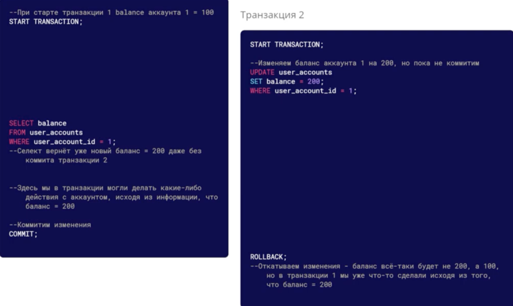
- Fuzzy read / non-repeatable read (неповторяющееся чтение) -  расчёты были сделаны на актуальных данных. Мы делаем в рамках одной транзакции расчёт на одних и тех же данных но кто-то паралельно их меняет. Первая транзакция исходила из того, что баланс 100, но пока она выполнялась, баланс стал 200, на моменте коммита транзакции мы не проверяем, что
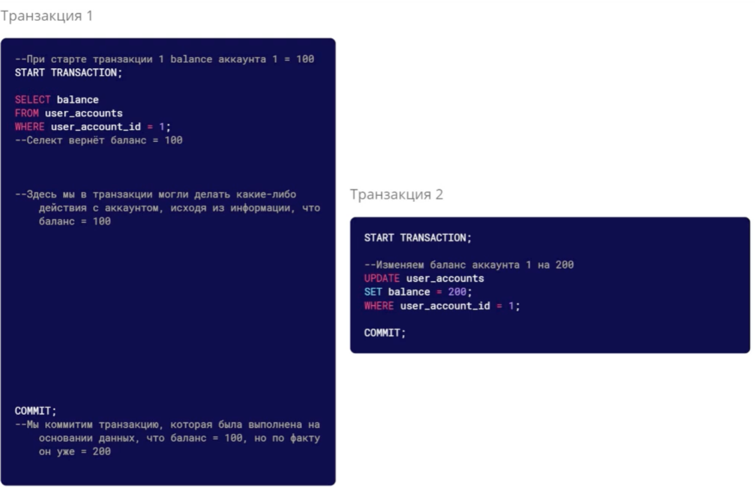
- Phantom read (фантомное чтение) - похоже не предыдущее, но разница в том, что читаем ряд данных, и пока транзакция выполняется кто-то может изменить ряд данных (добавить новую / удалить запись)
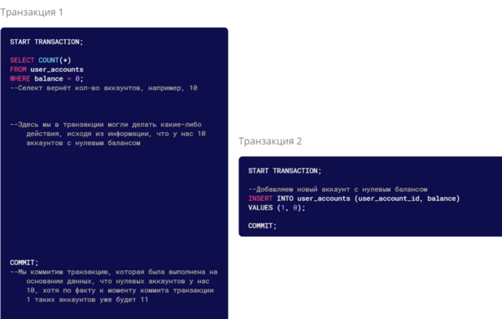

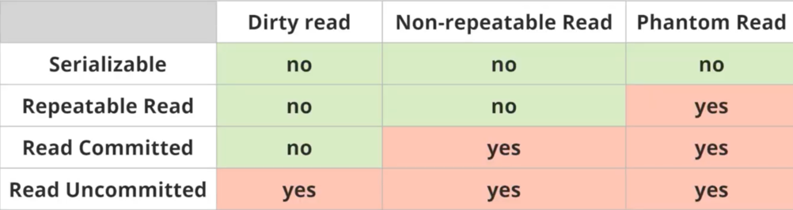

### Расскажи про проблему N+1

Когда запрашиваются данные с отношением «один-ко-многим», вместо одного эффективного SQL-запроса выполняется N + 1 запрос:
- Один запрос получает список основных объектов.
- Затем для каждого объекта из списка выполняется ещё N запросов, чтобы получить связанные данные.

Например, мы хотим получить клиентов и сделать для них маппинг товаров, в таком случае hibernate может развернуть запросы в такой:


Таким образом получается, что мы обращаемся к бд сначала с 1 и после с N запросами - это много.

Решается проблема просто, ведь можно выполнить LEFT JOIN таблицы Person и Items:
SELECT * FROM Person P JOIN Items I on P.id = I.person_id;

Это же можно сделать используя Spring JPA или в hibernate используя аннотацию @Query:
```java
List<Person> persons = session.createQuery("select p from Person p left join fetch p.items", Person.class).list();
```

left join fetch p.items обеспечивает загрузку сразу при получении Person

### Optimistic и Pessimistic locking exception

Это две разные стратегии предотвращения конфликтов, когда несколько пользователей пытаются изменить одни и те же данные одновременно

**Оптимистическая блокировка (Optimistic Locking)** 

Когда блокировка возникает редко. Тактика оптимиста в том, чтобы давать всем работать с данными, но если возник конфликт, то выбросить exception. 

Обычно в таблицу добавляется специальное поле — version. При обновлении записи СУБД проверяет, совпадает ли текущая версия в базе с той, которую считал пользователь. Если за время вашего редактирования кто-то другой уже успел сохранить изменения, версия в базе изменится - будет OptimisticLockException.

Делается это на уровне кода, а не СУБД.

**Пессимистичная блокировка (Pessimistic Locking)**

При частных блокировках. Пессимист даёт работать с данными только кому-то одному. 

Используются SQL-команды вроде SELECT ... FOR UPDATE. Пока первая транзакция не сделает COMMIT или ROLLBACK, остальные будут ждать своей очереди.

Этот механизм реальзован на уровне СУБД.

## Spring

### Какие есть способы конфигурирования Spring приложений?

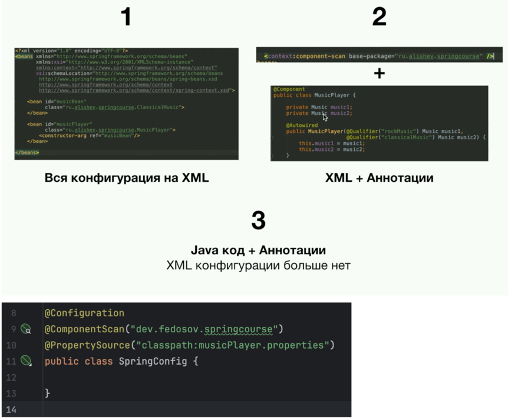

### Что такое Spring Bean?

Это объект класса, который был создан с помощью Spring, такие объекты помечаются аннотацией @Component

### Виды скоупов в Spring

По умолчанию бины Spring - это объект класса Singleton, то есть запрашивая бин, ты получаешь ссылку на один и тот же объект и соответственно изменение в поле у одного объекта изменяет это поле у всех объектов того же класса:

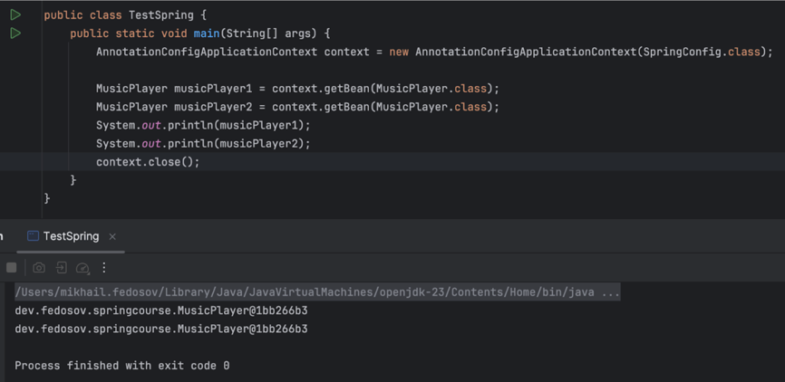

Если на бин проставить аннотацию @Scope(‘Prototype“), то получение бина из ApplicationContext будет возвращать ссылку на новый объект класса и изменение поля в этом объекте не будет менять поля в других объектах

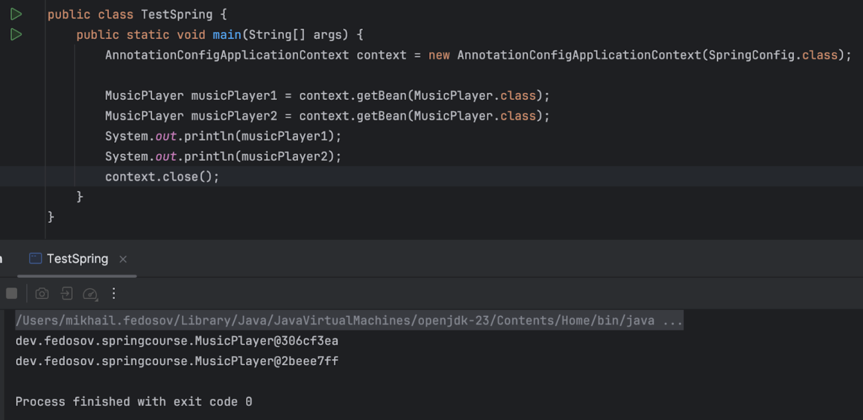

Для веб-приложений также используются 4 других скоупа:
- request - cоздаётся один экземпляр бина на один HTTP-запрос. Бин живёт на протяжении обработки запроса и уничтожается после его завершения. Используется для хранения данных, специфичных для текущего запроса: данные формы, аутентификация пользователя, параметры запроса и т.п.
- session - cоздаётся один экземпляр бина на одну HTTP-сессию. Бин живёт, пока активна сессия пользователя. Используется для хранения данных, связанных с конкретным пользователем в рамках его сессии: корзина покупок, профиль пользователя, настройки интерфейса.
- websocket - cоздаётся один экземпляр бина на WebSocket-сессию. Живёт, пока открыто WebSocket-соединение.
- application - cоздаётся один экземпляр бина на ServletContext (т.е. на всё веб-приложение). Похож на singleton, но область ограничена именно контекстом сервлета, а не всем Spring-контейнером (в котором может быть несколько контекстов). Использование: Для глобальных компонентов веб-приложения, которые должны быть едиными для всего приложения (например, счётчики, кэши).

### В чём разница @Autowired и @RequiredArgsConstructor?

- @Autowired - нужно сначала создать все бины, а уже затем проходимся по каждому бину и присваиваем значения в поля бина где есть аннотация
- @RequiredArgsConstructor - присваиваем значения в поля класса при его инициализации, из плюсов - это удобнее тестировать

### Жизненный цикл бина в Spring?

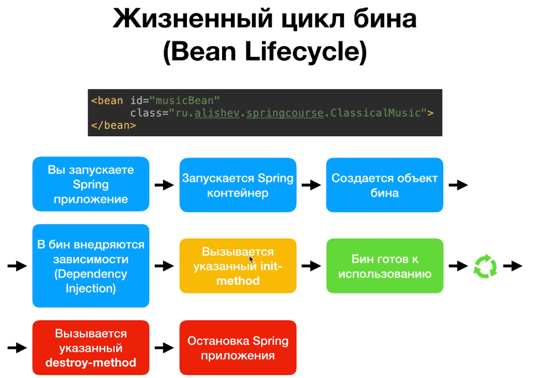

Пример:

```java
@Component
public class A {
    public String getValue() {
        return "Hello from A";
    }
}

@Component
public class B {
    @Autowired
    private A a;   // зависимость будет внедрена ПОСЛЕ конструктора

    public B() {
        // В конструкторе пытаемся использовать a — он ещё null!
        System.out.println(a.getValue());  // NullPointerException
    }
}
```

1) Spring начинает создавать бин B.
2) Вызывается конструктор B() — создаётся объект, но поле a ещё null.
3) В конструкторе происходит обращение к a.getValue() → NullPointerException.
4) Spring не может завершить создание бина и бросает BeanCreationException.

Для исправление нужно явно передавать бин в конструктор.

```java
@Component
public class B {
    private final A a;   // final — хорошая практика, но не обязательна

    // Явный конструктор, Spring автоматически внедрит параметры
    public B(A a) {
        this.a = a;
        // a уже инициализирован, можно безопасно использовать
        System.out.println(a.getValue());
    }
}
```

### Расскажи про аннотации @Contoller @Service @Repository в Spring


**@Contoller** отвечает за обработку запросов клиента к серверу и возврат ответов. Внутри используются аннотации @GetMapping , @PostMapping, @PatchMapping - мапинг путей роутера, @PathVariable - переменные в строке запроса, @ModelAttribute - мапинг данных в запросе на модели, @Valid валидация данных в запросе)

**@Service** в него вынесена вся основная бизнес-логика приложения, используется @Transactional для работы с репозиторием. Один сервисный класс может работать сразу с несколькими репозиториями - это ок, бизнес-логика бывает сложной.

**DAO (Обычный @Component) или @Repository** - выполняют запросы к БД. В сложных приложениях обычно есть оба варианта. DAO - прямая работа с БД, пишем запросы. Репозиторий - абстракция (CRUD операции и многое другое генерируются автоматически с помощью Spring JPA)

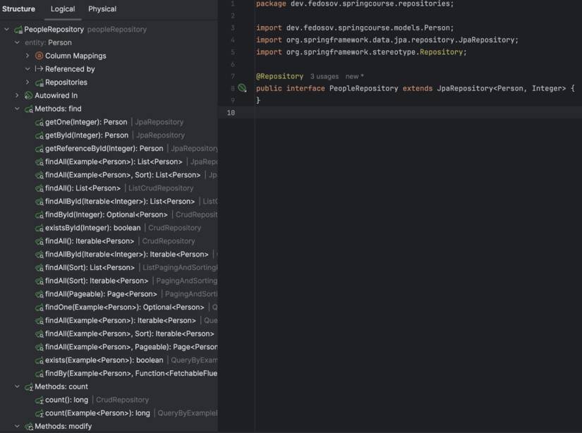

### Чем отличается @Mock от @Mockbean

@Mock используется для создания заглушек (моков) в unit-тестах, не требуя контекста Spring, тогда как @MockBean добавляет мок в контекст Spring (ApplicationContext), заменяя существующий бин, что необходимо для интеграционных тестов. @Mock быстрее, а @MockBean позволяет тестировать взаимодействие компонентов.


[//]: # (TODO: ## Кэширование)

[//]: # (TODO: ## CI/CD)

[//]: # (TODO: ## Мониторинг)

[//]: # (TODO: ## Тестирование)

[//]: # (TODO: ## Контейнеризация)

## Kafka

### Что такое Partition в Kafka

Партиции - это разбитие топика Kafka на части, сделано это для масштабирования и отказоустойчивости. Пропускная способность выше так как можно параллельно писать в 5 партиций, а не в 1 топик, например. Также можно параллельно отправлять запросы сразу на несколько серверов. При этом партиции реплицируются, когда пишем в одну партицию, тот же запрос дублируется в репликацию партиции и уже после отправка подтверждается. Распределение по партициям происходят случайно, либо, при наличии ключа в сообщении - по ключу. Гарантируется, что сообщения с одним и тем же ключом находятся в одной и той же партиции

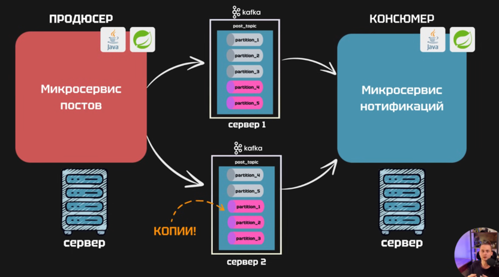

Партиции выщитывается по формуле hash(message_key) % кол-во партиций. message_key - например, id пользователя. Но если количество партиций меняется, то и остаток от деления меняется и старые сообщения теряются, так делать нельзя. Поэтому, партиции выделяют с запасом и вместо того чтобы менять кол-во создают новый топик с постфиксом _2

### Что такое Consumer Group в Kafka

Это объединение нескольких потребителей (Consumer) в одну группу, чтобы они вместе читали из одного топика - в группе у них единый offset и тогда каждое сообщение обрабатывается только один раз. Если потребители не состоят в группе, то на каждый потребитель свой offset и все эти потребители получают это сообщение.

[//]: # (TODO: ## Протоколы)

[//]: # (TODO: ## Архитектурные паттерны)

[//]: # (TODO: ## Нереляционные БД)
