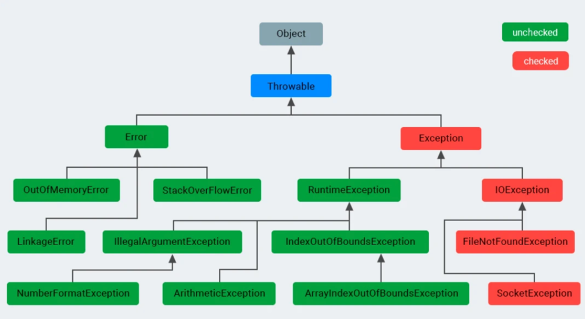
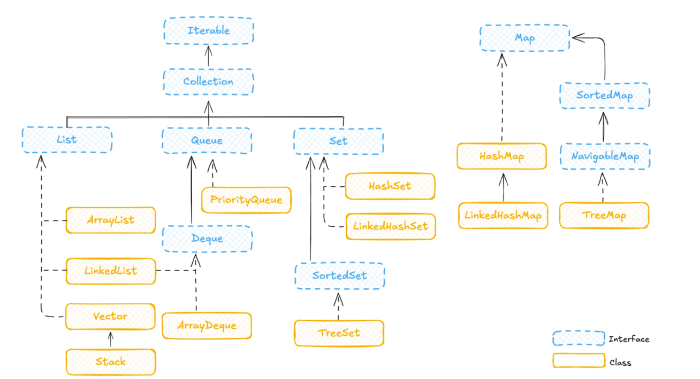
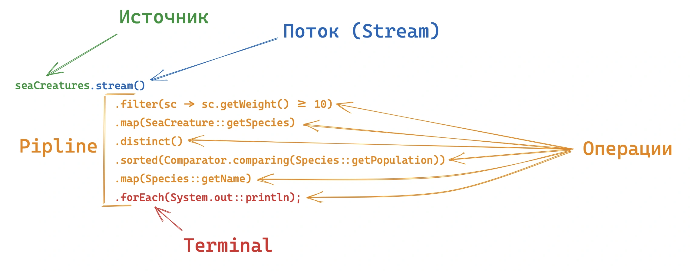
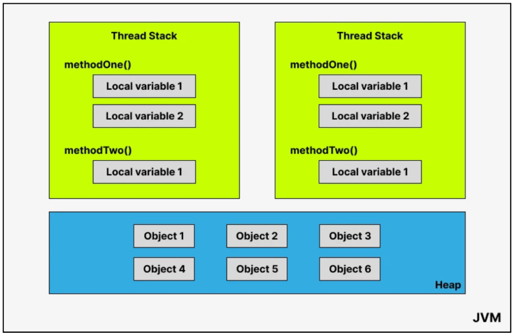
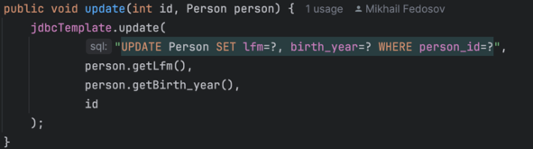
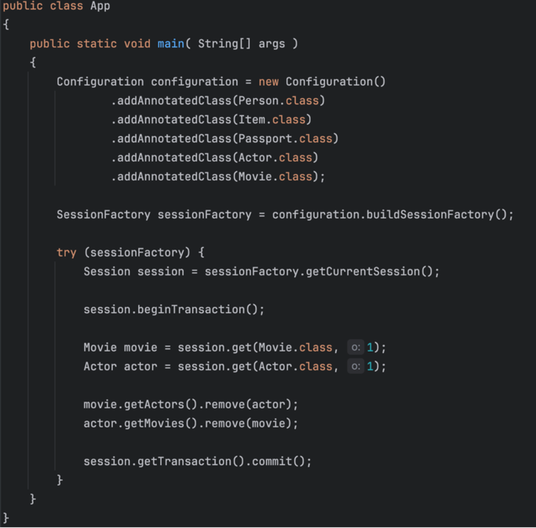
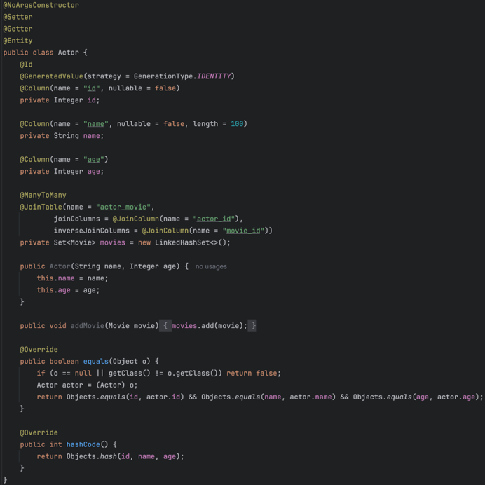
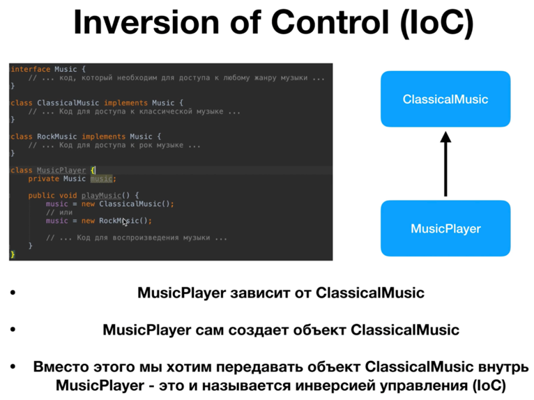
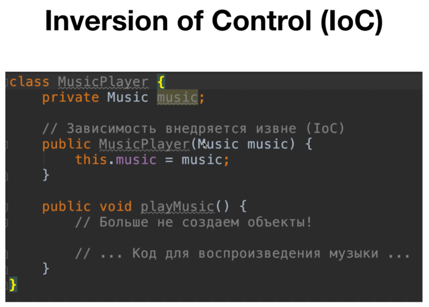
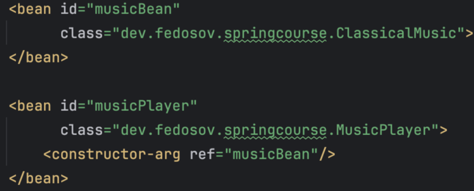

> больше полезных материалов по разработке в тг https://t.me/typo_programmist

**Содержание:**

<!-- TOC -->
  * [Java Core](#java-core)
    * [Что такое конструктор по умолчанию?](#что-такое-конструктор-по-умолчанию)
    * [Что такое неизменяемые (immutable) классы? Почему String неизменяемый?](#что-такое-неизменяемые-immutable-классы-почему-string-неизменяемый)
    * [Расскажи про исключения в java](#расскажи-про-исключения-в-java)
    * [Расскажи про Java Collection Framework](#расскажи-про-java-collection-framework)
    * [ArrayList vs LinkedList](#arraylist-vs-linkedlist)
    * [HashMap vs TreeMap](#hashmap-vs-treemap)
    * [В чем разница между String, StringBuilder и StringBuffer](#в-чем-разница-между-string-stringbuilder-и-stringbuffer)
    * [Какие есть виды ссылок в Java?](#какие-есть-виды-ссылок-в-java)
    * [Ленивые операции в Stream API](#ленивые-операции-в-stream-api)
    * [Как устроена память в Java?](#как-устроена-память-в-java)
    * [Как работать с БД в Java?](#как-работать-с-бд-в-java)
    * [Как остановить поток Java](#как-остановить-поток-java)
  * [ООП](#ооп)
    * [Чем интерфейс отличается от абстрактного класса?](#чем-интерфейс-отличается-от-абстрактного-класса)
    * [Как расшифровывается аббревиатура SOLID?](#как-расшифровывается-аббревиатура-solid)
  * [Общие](#общие)
    * [Что такое инверсия управления (IoC)?](#что-такое-инверсия-управления-ioc)
    * [Что такое внедрение зависимостей?](#что-такое-внедрение-зависимостей)
    * [Идемпотентые методы REST](#идемпотентые-методы-rest)
    * [Метод работает очень долго, всегда ли проблема именно в коде?](#метод-работает-очень-долго-всегда-ли-проблема-именно-в-коде)
<!-- TOC -->

[//]: # (TODO: ## Опыт)

[//]: # (TODO: здесь можно написать про STAR и базовые вопросы)

## Java Core

[//]: # (TODO: ### Устройство объекта Object)

[//]: # (TODO: ### Контракт equals и hashcode)

### Что такое конструктор по умолчанию?

В Java есть три различных типа конструкторов:
- Default Constructor (Конструктор по умолчанию)
- No-Argument Constructor (Конструктор без аргументов)
- Parameterized Constructor (Параметризованный конструктор)

Конструктор по умолчанию (Default Constructor) — это конструктор, созданный JVM во время выполнения, если конструктор не определен в классе.
Он инициализирует поля класса значениями по умолчанию.

```java
class DefaultConstructor{
    int id;
    String name;
}
```

Внутри JVM появится конструктор по умолчанию для этого класса, если мы создадим объект

```java
DefaultConstructor df= new DefaultConstructor();
```

Теперь, если мы напечатаем значение, то получим:

```java
df.id = 0
df.name = null.
```

[//]: # (TODO: ### Области видимости java)

### Что такое неизменяемые (immutable) классы? Почему String неизменяемый?

Объект, состояние которого нельзя изменить после создания. Все поля final, класс объявлен как final (чтобы нельзя было создать мутабельный сабкласс), нет сеттеров.
Причины неизменяемости String:
- **Безопасность**: String широко используется для параметров (URL, путь к файлу, имена классов). Если бы String был изменяемым, это могло бы привести к уязвимостям.
- **Потокобезопасность**: Immutable объекты безопасны в многопоточной среде, так как их состояние не может измениться, что исключает ошибки синхронизации.
- **Кэширование**: Поскольку строка не меняется, её хэш-код рассчитывается один раз и кэшируется, что делает String идеальным ключом в HashMap или HashSet.

### Расскажи про исключения в java



Всё исключения - это объект, они реализуют единый интерфейс Throwable (что-то что может быть выкинуто)

- **Error** - это ошибки на уровне JVM (Например, OutOfMemory, StackOverflow) их мы не обрабатываем в программе.
- **Exception** - ошибки на уровне программы. Их мы уже обрабатываем на уровне программы. Exception бывают checked и unchecked.


- **Checked exception** - разработчики Java добавили их, заставлять программиста избегать частых ошибок и обрабатывать их (Нет файла)
- **Unchecked exception** - они возникают в ходе исполнения программы (Runtime exception) (Деление на 0; обращение по индексу, которого нет в массиве).

* блок try - выполняет блок кода, который может вызвать исключение
* блок catch - обрабатывает исключение
* блок finally - дополнительный, выполняется ВСЕГДА после try-catch:

Даже тут runTimeExceptionFinally() вернёт 3:
```java
public static int runTimeExceptionFinally() {
    try {
        return 1;
    } catch (ArithmeticException e) {
        return 2;
    } finally {
        return 3;
    }
}
```

Если зашёл об этом разговор, нападай! Дай задачу:
```java
public static int runTimeExceptionFinally() {
    try {
        System.exit(0);
        return 1;
    } catch (ArithmeticException e) {
        return 2;
    } finally {
        return 3;
    }
}
```

Спроси, что выведится - ничего, finally в таком случае не отработает

### Расскажи про Java Collection Framework



Этот фреймворк реализует основные типы коллекций, которые нам могут понадобится в работе (List, Set, Map, Queue, Deque)

У этих коллекций 2 корня Collection - набор элементов, Map - набор пар ключ-значение

Корневым интерфейсом в JCF является Iterable, который позволяет перебирать элементы коллекции.

От Iterable наследуется интерфейс Collection, который служит основой для большинства других коллекций. Он предоставляет базовые методы, такие как add(), remove(), contains(), size() и другие.

Для повышения производительности в многопоточной среде, Java предоставляет более современные потокобезопасные коллекции, доступные в пакете java.util.concurrent:

* **CopyOnWriteArrayList** — потокобезопасная альтернатива ArrayList, где операции изменения создают копию списка, что исключает проблемы, связанные с итерацией.
* **ConcurrentHashMap** — потокобезопасная версия HashMap, оптимизированная для работы в многопоточных средах без блокировок всех операций.
* **ConcurrentLinkedQueue** — неблокирующая очередь, основанная на связанных узлах.

### ArrayList vs LinkedList

ArrayList:
* get(int index): O(1) — доступ по индексу.
* add(E element): Амортизированная O(1), но может быть O(n) при расширении.
* add(int index, E element): O(n) — нужно сдвигать элементы.
* iterator(): Итерация по массиву происходит очень быстро за счет локальности данных (кэш-память CPU).

LinkedList:
* get(int index): O(n) — нужно пройти от начала/конца до нужного элемента.
* add(E element): O(1) — просто повесить ссылку в конце.
* add(int index, E element): O(n) — сначала найти позицию (O(n)), потом повесить ссылки.
* iterator(): Итерация тоже O(n), но каждый следующий элемент — это переход по ссылке, что медленнее для кэша процессора, чем последовательное чтение массива.

Итерация по всему списку в LinkedList будет медленнее, чем в ArrayList, из-за промахов в кэше, даже если асимптотически это O(n). ArrayList — почти всегда выбор по умолчанию.

### HashMap vs TreeMap

* **HashMap**: Хранит ключи на основе хэш-кода. Позволяет null ключ и значения. Не гарантирует порядка. Сложность O(1) для get/put (в идеале).
* **TreeMap**: Реализует NavigableMap. Хранит ключи отсортированными согласно natural order или переданному Comparator. Основан на Красно-черном дереве. Сложность O(log n). Не допускает null ключей (сравнение выбросит NPE).

### В чем разница между String, StringBuilder и StringBuffer

* **String** — неизменяемый (immutable) класс, любая операция создает новый объект. Подходит для константных строк. Создавая через кавычки объект попадает в StringPool, через new() - в кучу.
* **StringBuilder** — изменяемый (mutable), работает быстрее StringBuffer, но не потокобезопасен. Используется для динамического построения строк в однопоточных приложениях.
* **StringBuffer** — аналогичен StringBuilder, но синхронизирован (потокобезопасен), что делает его медленнее.

Важно, что когда мы выполняем операцию конкатенации строк, например:
String result = "Hello" + ", " + "World" + "!";


JVM фактически выполняет следующие действия:
Создает временный объект StringBuilder
Добавляет каждую строку в этот StringBuilder
Вызывает метод toString() для создания финального объекта String
Это можно увидеть в байткоде, сгенерированном для такой операции. Однако, ситуация меняется внутри циклов. Рассмотрим следующий код:
```java
String result = "";
for (int i = 0; i < 1000; i++) {
    result += "some text";
}
```

В этом случае компилятор не оптимизирует код автоматически, и для каждой итерации создается новый StringBuilder, что приводит к созданию 1000 промежуточных объектов StringBuilder и String, большинство из которых немедленно становятся мусором. То есть StringBuilder выделяет, как массив нужную для него память с запасом, в то время как String каждый раз занимает новые ячейки памяти. На больших объёмах в цикле StringBuilder работает за O(n), а String за O(n^2).

### Какие есть виды ссылок в Java?

В Java есть 4 вида ссылок. По сути, различие между всеми типами ссылок только одно — поведение GC с объектами, на которые они ссылаются.

- Стандартный **StrongReference** — это самые обычные ссылки которые мы создаем каждый день. StringBuilder builder = new StringBuilder();
builder это и есть strong-ссылка на объект StringBuilder. Любой объект что имеет strong ссылку запрещен для удаления сборщиком мусора.

И есть 3 «особых» типа ссылок — SoftReference, WeakReference, PhantomReference.

- **SoftReference** — если GC видит что объект доступен только через цепочку soft-ссылок, то он удалит его из памяти. Потом. Наверно. Зависит от JVM. Одно знаем точно: GC гарантировано удалит с кучи все объекты, доступные только по soft-ссылке, перед тем как бросит OutOfMemoryError. То что нужно для кэширования.
- **WeakReference** — если GC видит что объект доступен только через цепочку weak-ссылок, то он “сразу” удалит его из памяти. Когда кэшировать объект не имеет смысла. Нам нужно только использовать его и желательно “сразу” удалить из памяти, когда объект более не используется программой.
- **PhantomReference** — если GC видит что объект доступен только через цепочку phantom-ссылок, то он его удалит из памяти. После нескольких запусков GC. Этот тип ссылок в позволяет нам узнать, когда объект более недоступен и на него нет других ссылок. Это позволяет нам сделать очистку ресурсов, используемых объектом, на уровне приложения.
https://habr.com/ru/articles/169883/

[//]: # (TODO: ### Garbage Collector)

[//]: # (Garbage Collector далее GC: При запуске сборщика виртуальная машина рекурсивно находит, для всех потоков, все доступные объекты в памяти и помечает их неким образом. А на следующем шаге GC удаляет из памяти все непомеченные объекты. Таким образом, после чистки, в памяти будут находиться только те объекты, которые могут быть полезны программе.)

### Ленивые операции в Stream API

Операции в стримах делятся на промежуточные (intermediate) и терминальные (terminal). Промежуточные операции (filter, map, sorted) являются "ленивыми". Они не выполняются сразу при вызове, а только запоминаются. Вычисление начинается только тогда, когда вызывается терминальная операция (collect, forEach, count). Это позволяет оптимизировать обработку, не перебирать данные лишний раз и работать с бесконечными потоками.



Важно:
* Промежуточных операторов вызванных на одном стриме может быть несколько, в то время терминальный оператор только один
* Обработка не начнётся до тех пор, пока не будет вызван терминальный оператор.
* Как только была вызвана терминальная операция, поток считается исчерпанным и больше не может быть использован.

**Stateless и Stateful операции**

- Операции без состояния, такие как map() и filter(), обрабатывают каждый элемент потока независимо от других.
- Операции с состоянием, такие как sorted(), distinct() или limit(), требуют информации о других элементах потока. Эти операции не могут начать возвращать результаты, пока не обработают часть или весь поток.

При добавлении операций с состоянием поток делится на секции, и каждая секция должна завершить свою обработку перед началом следующей.

```java
public static void main(String[] args) {
    final List<String> list = List.of("one", "two", "three");

    list.stream()
            .filter(s -> {
                System.out.println("filter: " + s);
                return s.length() <= 3;
            })
            .map(s1 -> {
                System.out.println("map: " + s1);
                return s1.toUpperCase();
            })
            .sorted()
            .forEach(x -> {
                System.out.println("forEach: " + x);
            });
}
```

```text
filter: one
map: one
filter: two
map: two
filter: three
forEach: ONE
forEach: TWO
```

**Ленивая обработка в stream api**
```java
public static void main(String[] args) {
    final List<String> list = List.of("one", "two", "three");

    list.stream()
            .filter(s -> {
                System.out.println("filter: " + s);
                return s.length() <= 3;
            })
            .map(s1 -> {
                System.out.println("map: " + s1);
                return s1.toUpperCase();
            })
            .forEach(x -> {
                System.out.println("forEach: " + x);
            });
}
```

На первый взгляд может показаться, что весь список сначала отфильтруется, затем преобразуется, а после этого будет выведен на консоль. Однако, благодаря ленивой обработке, это происходит не так. Вместо того, чтобы обрабатывать все элементы на каждом этапе, Stream API последовательно пропускает каждый элемент через весь пайплайн операций.
```text
filter: one
map: one
forEach: ONE
filter: two
map: two
forEach: TWO
filter: three
```

Этот поэтапный подход делает параллелизм более простым и безопасным. Поскольку каждый элемент обрабатывается независимо, легко перейти от последовательного к параллельному потоку.

**Параллельное выполнение**

По умолчанию потоки выполняются последовательно, но с явным вызовом одного из методов parallelStream() или parallel() поток переключается в параллельный режим.

Если в JVM стоит другая настройка и потоки по умолчанию параллельные, то сделать их однопоточными можно через sequential()

Главное понимать, что тот флаг паралельности, которые будет проставлен перед терминальной операции означает каким будет поток, место вызова флага не важно:

```java
new Random().ints(1, 20+1).distinct().limit(5).sum(); // однопоточная операция в стандартном JVM
new Random().ints(1, 20+1).parallel().distinct().limit(5).sum(); // паралельный вызов
new Random().ints(1, 20+1).distinct().parallel().limit(5).sum(); // паралельный вызов
new Random().ints(1, 20+1).distinct().limit(5).parallel().sum(); // паралельный вызов - порядок не важен
new Random().ints(1, 20+1).parallel().distinct().limit(5).sequntial().sum(); // однопоточный вызов, так как перед терминальна
```

### Как устроена память в Java?

Модель памяти в Java, используемая внутри JVM, делит память на стеки потоков (**thread stacks**) и кучу (**heap**).

Все потоки, работающие в JVM, имеют свой стек:


Стек потока содержит:
* Стек вызова (какие методы вызвал поток)
* Все локальные переменные (boolean, byte, short, char, int, long, float, double)
* Ссылка (локальная переменная) хранится в стеке потоков, но сам объект хранится в куче

Когда метод завершает выполнение, блок памяти (frame), отведенный для его нужд, очищается, и пространство становится доступным для следующего метода. (LIFO)

Куча (Heap) содержит:
* Новые объекты всегда создаются в куче, а ссылки на них хранятся в стеке.
* Поля объекта хранятся в куче вместе с самим объектом, даже если это примитивные типы.
* Все массивы, независимо от того, содержат ли они примитивные типы или объекты
* Хранит String pool

Куча делится на поколения для оптимизации работы GC:
* **Young Generation**: Место появления новых объектов.
* **Old Generation**: Место для «долгоживущих» объектов, переживших несколько циклов сборки мусора.
Хабр

Также есть области:
* **Metaspace**: Хранит метаданные классов, код методов и статические переменные. Пример, информация о том, что у класса User есть метод login(), будут лежать в Metaspace.
* **PC Registers**: Хранят адрес текущей инструкции, выполняемой потоком. Пример, если ваш поток (Thread) сейчас выполняет сложение a + b, PC Register хранит адрес этой конкретной инструкции. Как только сложение завершится, регистр обновится и укажет на следующую строку (например, System.out.println). Так, если операционная система прервет работу потока, чтобы дать поработать другому, благодаря PC Register поток «вспомнит», на чем он остановился.
* **Native Method Stack**: Память для методов, написанных на других языках (например, C/C++). Java часто обращается к функциям, написанным на C или C++ (например, для работы с файлами, сокетами или видеокартой). Когда вы вызываете native методы System.currentTimeMillis(), Java обращается к операционной системе

[//]: # (TODO: ### Что такое thread-local переменные?)

### Как работать с БД в Java?

Есть 3 семейства как можно работать с БД:
* **JDBC** (В Java мире это один способ, всё остальное - надстройка) и jdbcTemplate

* Query Builder - **jooq** (жук)

* **ORM** (Hibernate, Object Relational Maping)



### Как остановить поток Java

Правильный способ остановить поток в Java — использовать механизм прерываний interrupt()

[//]: # (TODO: ### Дженерики - что это такое и зачем нужн)

[//]: # (TODO: ### Что такое JIT)

[//]: # (TODO: ### Как дебажить heap dump)

[//]: # (TODO: ### JVM, JRE, JDK - в чём разница)

## ООП

### Чем интерфейс отличается от абстрактного класса?

Абстрактный класс — это «заготовка» класса: реализовано большинство методов (включая внутренние), кроме нескольких. Эти несколько нереализованных методов вполне могут быть внутренними методами класса, они лишь уточняют детали реализации. Абстрактный класс — средство для повторного использования кода, средство, чтобы указать, какой метод обязан быть перекрыт для завершения написания класса.

Интерфейс — это своего рода контракт: интерфейсы используются в определениях чтобы в первую очередь указать смысл объекта, какие у него входные и выходные параметры.

### Как расшифровывается аббревиатура SOLID?

* S - Single Responsibility, принцип единственности ответственности, класс должен отвечать за один конкретный функционал в программе. А значит причин для его изменения тоже будет только одна. Подключение подписки клиенту не должно выполняться вместе с поиском crmId клиента.
* O - Open Closed, принцип открытости / закрытости. Класс открыт для расширения и закрыт для изменения. Иначе так можно много поломать, новые версии должны быть совместимы со старыми файлами, идеальны пример:

* L - Liskov Substitution, принцип подстановки подкласса. Наследники класса должны сохранять расширять функционал родителя, а не изменять его. В самолете может быть просто дверь, а может быть дверь с физюляжем
* I - Interface Segregation, принцип разделения интерфейсов. Один интерфейс не должен реализовывать несколько сложных действий, так становится много ненужного кода. В машине можно выключить звук/переключить трек с руля или с магнитолы, при этом с магнитолы нельзя включить дальний свет и управлять автомобилем, это отдельные интефейсы
* D - Dependency Inversion, принцип инверсии зависимостей. Вместо зависимости от конкретных реализаций (классов) модули должны зависеть от абстрактных классов или интерфейсов. Чтобы при изменении конкретной реализации не было серьёзных проблем.


[//]: # (TODO: ### Расскажи про принципы ООП)

## Общие

### Что такое инверсия управления (IoC)?

Это архитектурный подход, когда сущность не сама создаёт свои зависимости, а когда зависимости прокидываются извне.

До IoC:


После IoC:


### Что такое внедрение зависимостей?

Внедрение зависимостей — это не технология, фреймворк, библиотека или что-то подобное. Это просто идея. Идея работать с зависимостями вне зависимого класса (желательно в специально выделенной части).

Например, через XML-конфигурацию бинов в Spring:


### Идемпотентые методы REST
Идемпотентными методами в REST (при повторном вызове которых состояние системы не меняется) являются:
* **GET**: Читает данные, не меняя состояние.
* **PUT**: Полностью обновляет или создает ресурс; повторы не создают лишних сущностей.
* **DELETE**: Удаляет ресурс; повторное удаление не меняет состояние системы (ресурс уже удален).
* **HEAD**: Получает только заголовки, безопасен.
* **OPTIONS**: Возвращает поддерживаемые методы.

Неидемпотентные методы:
* **POST**: Создает новый ресурс при каждом вызове.
* **PATCH**: Частично обновляет ресурс, может приводить к разным результатам. (Например, PATCH может делать +1 к значению, не идемпотентен)


### Метод работает очень долго, всегда ли проблема именно в коде?
1) Спроси менеджера, а должен ли он работать быстрее? Может за 15 секунд он выдаёт csv 15 мб, это вроде норм.
2) Идём в профилирование, смотрим внешние вызовы. Не всегда проблема в коде, возможно проблема в отсутствии асинхронных операций - обращение к БД, поход к внешнему API. Метод работает 700мс, 500мс проводим в базе, для начала стоит оптимизировать запросе в БД.

[//]: # (TODO: ## Java Multythreading)

[//]: # (TODO: ## Git)

[//]: # (TODO: ## Реляционные БД)

[//]: # (TODO: ## Spring)

[//]: # (TODO: ## Кэширование)

[//]: # (TODO: ## CI/CD)

[//]: # (TODO: ## Мониторинг)

[//]: # (TODO: ## Тестирование)

[//]: # (TODO: ## Контейнеризация)

[//]: # (TODO: ## Брокеры сообщений)

[//]: # (TODO: ## Протоколы)

[//]: # (TODO: ## Архитектурные паттерны)

[//]: # (TODO: ## Нереляционные БД)
